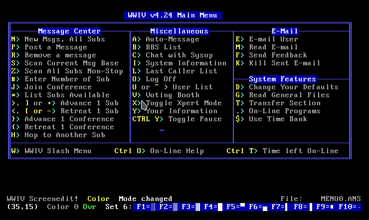
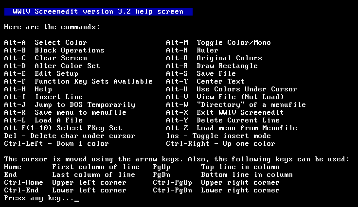
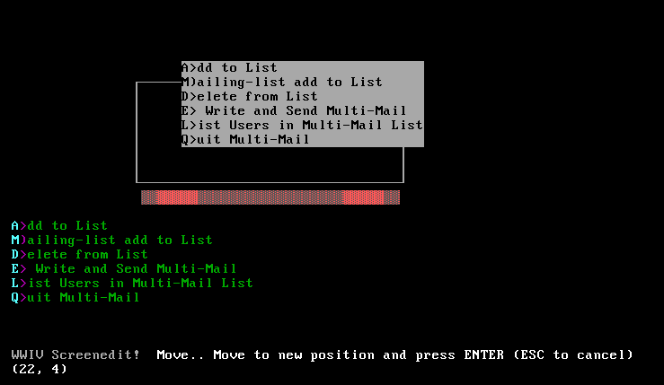

# --==[[ WWIV Screenedit ]]==--

WWIV Screenedit (WWIVSCRN) for MS-DOS with WWIVTYPE viewer for `.MSG` files.

## Background

I wrote this in 1990 after learning Pascal and used it to edit custom menus
and screens for WWIV BBSs. I had only distributed binaries, but just found the
source code on an old floppy disk. This is the first real complete software
application I ever wrote and distributed.

Original documentation:

 * [WWIVSCRN.DOC](../WWIVSCRN.DOC)
 * [WWIVTYPE.DOC](../WWIVTYPE.DOC)

## Screenshots

Loaded a WWIV menu

Help screen

Block move

## License (MIT License)

Copyright 1990 C. Ivan Cooper

Permission is hereby granted, free of charge, to any person obtaining a copy
of this software and associated documentation files (the "Software"), to deal
in the Software without restriction, including without limitation the rights
to use, copy, modify, merge, publish, distribute, sublicense, and/or sell
copies of the Software, and to permit persons to whom the Software is
furnished to do so, subject to the following conditions:

The above copyright notice and this permission notice shall be included in all
copies or substantial portions of the Software.

THE SOFTWARE IS PROVIDED "AS IS", WITHOUT WARRANTY OF ANY KIND, EXPRESS OR
IMPLIED, INCLUDING BUT NOT LIMITED TO THE WARRANTIES OF MERCHANTABILITY,
FITNESS FOR A PARTICULAR PURPOSE AND NONINFRINGEMENT. IN NO EVENT SHALL THE
AUTHORS OR COPYRIGHT HOLDERS BE LIABLE FOR ANY CLAIM, DAMAGES OR OTHER
LIABILITY, WHETHER IN AN ACTION OF CONTRACT, TORT OR OTHERWISE, ARISING FROM,
OUT OF OR IN CONNECTION WITH THE SOFTWARE OR THE USE OR OTHER DEALINGS IN THE
SOFTWARE.

